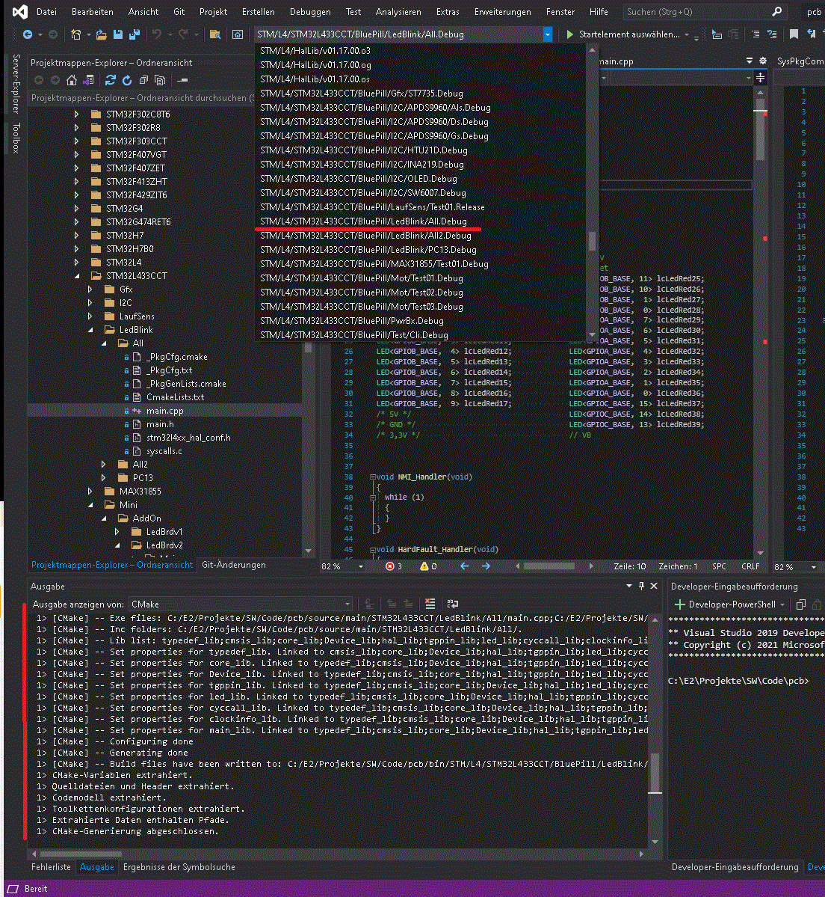

# PCB
Build chaind based on Python and Cmake
Windows only

## Setup
Several Tools are needed to get it running.
The refenrences to the tools are defined in ./scripts/prepare.bat

### Global software:
Mandatory: Python: https://www.python.org/
Optional: Visual Studio 2019 Community: https://visualstudio.microsoft.com/de/vs/older-downloads/

### Local software:
Copied to a separate folder and referenced in files \pcb\scripts\prepare.bat

#### BuildChain:

Mandatory: Ninja 1.8.2: Used for Buildchain
https://ninja-build.org/

Mandatory: CMAKE 3.19.0:  Used for the build chain
https://cmake.org/

Mandatory/depending on target: GCC: Compiler for build chain
  - Arm: https://gcc.gnu.org/: 10.3.1 20210824 (release)
    GNU Tools for Arm Embedded Processors 7-2018-q2-update) 7.3.1 20180622 (release) [ARM/embedded-7-branch 
  - RiscV for CH32: Took from MounRiver installation

#### Programming and Debugging:
Mandatory/depending on target:

EmBitz v02.63: https://www.embitz.org/: Used as ARM debugger 
  Driver needs to b installed

OpenOcd: https://openocd.org/: Used for flashing
  - 0.11.0-WCH: Took from MounRiver installation
  - 0.12.0-0: for ARM

STProgrammer: https://www.st.com: v.2.11.0: Used for flashing

STLink: https://www.st.com: v4.0.0.0: Used for flashing  
  Driver needs to b installed

#### Optional:
AMap 0.30 (64-Bit): Used as map tool
http://www.sikorskiy.net/prj/amap/

## First step
After all tools were setup, the libs need to be created. This takes around 1h and is done by executing ***Build_Libs.bat***
In case you are using VS the .json files should be updated. Run ***VS2017_Pre * all***
Then you can try to build a project calling ***Build****

Note: Most of the old projects aren't maintained. So they won't build.

## Folder structure

 + .git: contains the git stuff
 + .bin: contains every thing, that was build, created or generated
 + cfg: contains all configuration
    + [subfolder]: contains the project specific configuration, like linker files, package list (used packages), build options
    + ProjectConfig_[platform].py: contains the configurations (setting, tools & parameter) for a specific platform
    + ProjectList.py: contains the list of all projects
 + scripts: contains the build chain' s python scripts, cmake scripts and the debugger svds
 + source: contains all source code and precompiled libs
 + Build.bat: To select and build a project
 + Build_Libs.bat: To build some libs
 + Build(x)All.bat: Shortcut to build platform specific project
 + CMakeLists.txt: root cmake
 + CMakeSettings.json: To make project visible in Visual Studio
 + debug.bat: Flash project and start the debugger
 + debug2.bat: No Flash and start the debugger
 + elf2bin.bat: Convert elf to bin
 + elf2lst.bat: Convert elf to lst
 + flash.bat: Program a project to the target
 + GenEB.bat: Generate a EmBitz workspace
 + map.bat: Open the mapfile viewer
 + PkgGenLists.bat: Generates the cmake-filelists-files used by the package
 + psize.bat: Return size of a project
 + README.md: this file
 + strip.bat: Strips only the project related files out of pcb
 + tc.bat: Shortcut for the scripts/toolcaller.py
 + VS2017_Pre.bat: Generate the CMakeSettings.json

## How to Build

### Console

Call ***[root]/Build.bat***

If no arguments are given, all available project are listed for selection.
If used with arguments
Build.bat arg1 arg2
 + arg1: is used as filter
 + arg2: selection mode: like ***first***, ***all***

e.g. 
  + build * all         
    > same as just build
  + build *stm/L4* all
    > build all projects, that contains ***stm/L4***
  + build *xyz* first
    > build only the first project, that contains ***stm/L4***

### Visual Studio
In case you are using VS the .json files should be updated. Run ***VS2017_Pre * all***

Start Visual Studio and open folder -> pcb

Select the target project

Check the cmake output ***output*** window

If cmake fails, try delete config and reconfig

Build the project

Open a command box and enter ***flash***.
Flash the project

Debug the project

 

    

